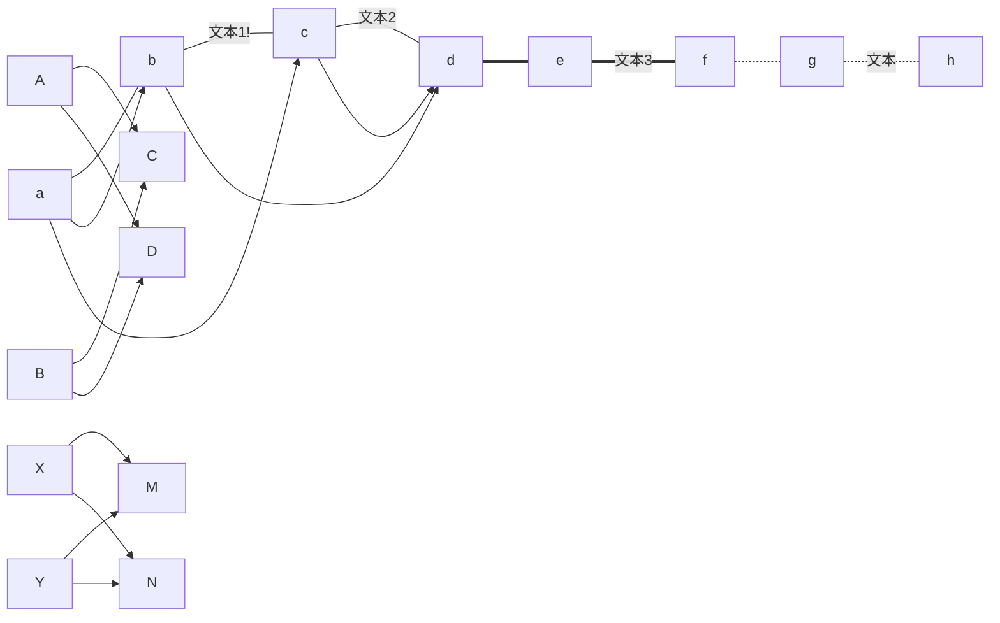

# aws-appconfig-go
golang aws sdk test 


```text

├── Makefile
├── README.md
├── build
│   └── aws_appconfig
├── console.log
├── docker
│   └── Dockerfile
├── go.mod
├── go.sum
├── main
│   └── main.go
└── vendor


```


